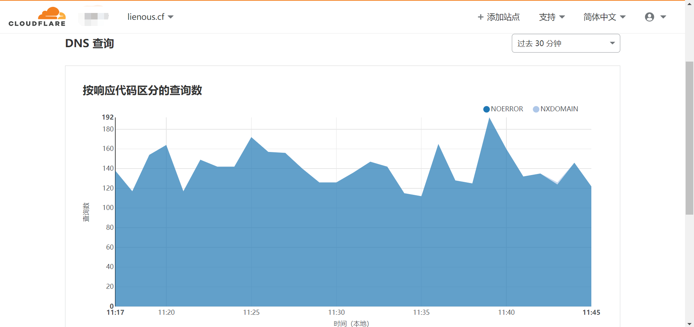

之前在客户现场有发现过期的C2域名，便随手注册了一波。现在空闲下来分析一下受害情况。

## 域名相关信息

1.  **doc.lienous.cf**  

   某挖矿病毒上报信息使用。该病毒会通过TCP协议向C2机器8080端口上报受害者信息，包含受害机器名字、内网IP、系统版本等。

   

   对于该病毒的有关报告：http://it.rising.com.cn/dongtai/19379.html

2. **ace.sewace.tk**

   人生日历（LifeCalendarWorm），2018年12月14日下午，监控到一批通过 “人生日历”升级程序下发的木马蠕虫，其具备远程执行代码功能，启动后会将用户计算机的详细信息发往木马服务器，并接收远程指令执行下一步操作。 同时该木马还携带有永恒之蓝漏洞攻击组件，可通过永恒之蓝漏洞攻击局域网与互联网中其它机器。

   

   值得注意的是，该病毒发起的请求中并不携带域名信息。即先通过DNS方式解析ace.sewace.tk，而后再把解析到的IP直接装填入http请求中。意味着无法通过域名特征对该病毒进行阻断。

   相关报告：https://cert.360.cn/warning/detail?id=57cc079bc4686dd09981bf034130f1c9

## 受害者信息统计

1. DNS层面

   把上述域名的NS地址都指向了CloudFlare。通过DNS解析情况对受害者信息进行大致判断。

   + **doc.lienous.cf**  

     

     lienous.cf 每分钟的解析数为120-200之间。

   + **ace.sewace.tk**

     

     sewace.tk 每分钟的解析数为420-540之间。

2. HTTP层面

   + **doc.lienous.cf**

     虽然该木马使用的是TCP协议，不过我们还是能在8080端口开放一个HTTP服务对受害者的访问情况进行分析。  部署时间为 [08/Sep/2020:12:33:46 +0800]--[21/Oct/2020:10:44:42 +0800]，期间共收到请求399W条。

     ```shell
     $ cat doc.lienous.cf.log  | wc -l
     3994702
     ```

     对IP进行去重得到67929个IP。
     
     ```shell
     $ awk '{print $1}' doc.lienous.cf.log | sort | uniq -c | wc -l
     67929
     ```
     
     其中访问量最大的20个IP地址为：
     
     ```shell
     $ awk '{print $1}' doc.lienous.cf.log | sort | uniq -c | sort -nr -k1 | head -n 20
       98220 180.151.58.116 [印度]
       96924 221.226.66.118 [江苏省南京市 电信]
       72135 218.76.1.76    [湖南省长沙市 电信]
       44404 113.106.221.130[广东省惠州市 电信]
       43234 222.87.144.149 [贵州省六盘水市 电信]
       26238 112.5.18.71    [福建省泉州市 移动]
       24424 123.130.114.201[山东省烟台市 联通]
       20193 120.237.221.117[广东省惠州市 移动]
       18036 27.191.157.178 [河北省唐山市 电信]
       16036 59.172.63.246  [湖北省武汉市 电信]
       15835 182.78.237.77  [印度 Airtel]
       15475 58.23.7.26     [福建省厦门市 联通]
       15065 123.183.161.192[河北省邢台市 电信]
       13047 101.99.33.197  [越南胡志明]
       11943 222.222.150.78 [河北省保定市 电信]
       10397 122.224.158.228[浙江省杭州市 电信]
        9328 211.157.146.2  [北京市昌平 263网络通信]
        9315 116.197.130.203[印度尼西亚雅加达]
        9273 218.17.27.115  [广东省深圳市 电信]
        9214 223.83.138.50  [江西省吉安市 移动]
     ```
     
   + **ace.sewace.tk**
   
     部署时间为 [09/Sep/2020:15:56:12 +0800]--[21/Oct/2020:10:50:06 +0800]。共收到包含有mac地址的请求1703W条。 
   
     ```shell
     $ grep "mac=" sewace.tk.log | wc -l
     17030999
     ```
   
     发起请求的客户端IP有34W条
   
     ```shell
     $ awk '{print $1}' sewace.tk.log | sort | uniq -c | wc -l
     345254
     ```
   
     其中访问量最大的20个IP地址为：
   
     ```shell
     $ awk '{print $1}' sewace.tk.log.1 | sort | uniq -c | sort -nr -k1 |
     head -n 20
       67023 210.22.148.210
       53585 220.182.56.73
       51762 220.182.56.74
       51204 220.182.56.78
       49678 202.141.254.130
       41421 82.137.255.8
       40818 190.152.146.186
       34811 195.146.82.186
       32945 58.218.200.199
       32703 203.155.38.234
       30689 60.30.193.162
       27118 221.232.177.141
       24524 122.70.157.178
       23525 203.130.153.10
       22969 182.78.249.146
       22442 120.192.177.21
       22044 202.100.206.36
       21124 218.92.230.18
       20340 202.100.206.35
       19934 220.168.209.130
     ```
   
     写个脚本来统计受害MAC地址信息。
   
     ```python
     import re
     with open("sewace.tk.log","rb") as f:
         log = f.read().decode()
         r = re.compile("mac=(.*?)&")
         macs = r.findall(log)
         macs = set(macs) #结果去重
         with open("macs.txt","wb")as f1:
             f1.write("\n".join(macs).encode())
     ```
   
     得到MAC地址14W 条。
   
     ```shell
     $ wc -l macs.txt
     144067 macs.txt
     ```
   
   按照目前数据来看。`ace.sewace.tk`也就是驱动人生的受害者现存活低于14W。而另一款挖矿病毒的现存活估算低于4W。且受害者地区大都位于东南亚，包括但不限于 中国、泰国、印度等。

## 总结

其实本想是否能通过接管C2对病毒整体进行接管实现命令下发。无奈太菜了，并不知病毒整体逻辑，所以只能做到对受害者进行统计。

附赠访问次数最多的1000个客户端Ip。以便自查。  

doc.lienous.cf.top500ip.log
sewace.tk.top500.log